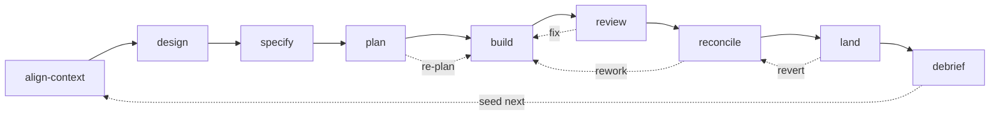

# Dev-sprint graph — the map

The consolidated whole-picture view: every node with its type, goal, and edges — the single
artefact we author from. Detail and prior art live in [`graph-design.md`](graph-design.md);
decisions in [`decisions.md`](decisions.md). This is the capstone of the design phase; the
**handbook resync (D22–D30)** and node authoring follow.

## Legend

**Primitive:** `skill` (loads into current context — operator-in-loop) · `agent` (isolated
context, returns a summary) · `script` (deterministic executable) · `inline` (tool/MCP call in a
body, not a node) · `ref` (referenced artefact) · `block` (define-once resolver, D25).
**Collab:** C = collaborative · A = autonomous · — = n/a.
**Edges:** `precedes`/`can-follow` (process, may cycle) · `invokes`/`loads`/`composes-into`/
`references` (structural) · `overlay` (harness). Modes-as-nodes (D22) are listed under their parent.

## The arc (backbone + loops)

Sub-arcs and the shared layer attach by `invokes`/`composes-into` (see tables). The collaborative
front (align→design→specify→plan) and close (reconcile→debrief) run in the **main thread**; the
**build** and **review** spans fan out to **isolated agents**.

## Backbone stages (9)

| id | primitive | collab | goal (outcome) | composes / invokes |
|---|---|---|---|---|
| `align-context` | skill | C | shared, correct intent + constraints before design | explore; modes: lightweight/standard/deep/spec |
| `design` | skill | C | load-bearing questions resolved by outcome; design doc out | explore, lens-family (doc, strategy-first then parallel) |
| `specify` | skill | C | design → canonical spec amendment + touchpoints | pr-author, drift-detector (spec-layout only; else null) |
| `plan` | skill | C | staged, dependency-annotated plan; agent-per-workstream; teaches planning principles | explore, lens-family (plan-review, sequential); modes: compose/deepen/re-plan |
| `build` | skill | C→A | planned change implemented to spec, checkpointed (long autonomous span) | debug, explore, worktree, per-unit workers; modes: inline/serial/parallel |
| `review` | skill | C | independent verification before landing; findings triaged | lens-family (diff, parallel), qa, design-review, security; modes: interactive/autofix/report-only/headless |
| `reconcile` | skill | C | spec ?= reality; owns reconcile→build loop + gate to land | spec-diff, log-decision, harness spec-amend; modes: draft/adjudicate/enact |
| `land` | skill | C+gate | verified change to prod, confirmed healthy | ship → deploy → canary |
| `debrief` | skill | C | measure outcomes, capture learnings, amend/route, seed next | measure-outcomes, capture-learnings, log-decision |

`dev-sprint` itself is the **arc** — derived from these stages' `composes-into` + process edges,
not a file.

## Sub-arcs (invoked; also standalone)

| id | primitive | goal | invoked by | notes |
|---|---|---|---|---|
| `debug` | skill | root-cause + minimal fix (Iron Law: no fix without root cause) | build, review | invokes `investigate-probe` |
| `investigate-probe` | agent | read-only hypothesis probe (×N parallel) | debug | |
| `code-review` | skill→agents | static diff correctness/safety review | review; standalone | back-ends (codex/mistral) pluggable; modes ×4 |
| `qa` | skill | live behavioural browser testing + fix-loop | review; standalone | uses browse; `qa-only` = report-only mode |
| `security` | agent/skill | security judgment, diff to whole-surface | review, plan, standalone/periodic | modes: lens / plan-lens / daily / comprehensive; one persona |
| `design-review` | skill | visual QA on the live app + fix-loop | review; standalone | uses browse; shares ux-principles |
| `plan-design-lens` | skill | plan-stage design completeness + mockups | design, plan | the design lens's doc home |
| `design-shotgun` | skill | generate visual variants, comparison board, collect feedback | design (UI work) | uses `$D` + browse; the *generate* half of the shotgun pattern |
| `design-implement` | skill | production UI (HTML/CSS) from an approved design | build (UI units) | design-html / CE `ce-frontend-design`; shares DESIGN.md + ux-principles |
| `optimise` | skill | generate impl variants → benchmark each → select winner | build (perf-critical); standalone | the generate-measure-select shape; composes worktree + benchmark |
| `ship` | skill | tests→coverage→version→commit→PR (ends at PR) | land; standalone | |
| `deploy` | skill | merge → deploy → wait | land | modes: staging-first/prod-direct/staging-only |
| `canary` | agent/skill | post-deploy health on live prod | land; standalone | uses browse; modes: quick/full |
| `scrape` | skill | read-only data extraction | standalone (peripheral) | uses browse |

## Lens family (shared; D27)

One **dispatch** node + one **agent node per lens** (`target`-parameterised: doc | diff). Consumed
by `design` (doc), `plan` (plan-review, sequential), `review` (diff, parallel). Product-specific
lenses attach as **harness overlays**.

| id | primitive | activation | hunts |
|---|---|---|---|
| `lens-dispatch` | skill | always (in consuming stage) | fan-out → dedup → corroborate → confidence-gate → severity-route |
| `lens-correctness` | agent | always-on | logic, edge cases, state, swallowed errors |
| `lens-security` | agent | always-on (lower gate) | injection, authz, secrets (= `security` lens mode / shared persona) |
| `lens-tests` | agent | always-on | coverage gaps, weak assertions |
| `lens-maintainability` | agent | always-on | complexity, coupling, dead code |
| `lens-adversarial` | agent | gated (risk/size) | assumption violations, abuse cases |
| `lens-performance` | agent | conditional | DB/loops/IO/async |
| `lens-design` | agent | conditional (UI) | = `plan-design-lens` (doc) / design-review (diff) |
| `lens-dx` | agent | conditional (dev-facing) | API/CLI/docs friction |
| `lens-runtime` | agent | conditional | error handling, retries, migrations |
| `lens-external` | agent | conditional/opt-in | cross-model (codex/mistral) second opinion |

## Shared sub-nodes (the reuse layer)

| id | primitive | goal | consumed by |
|---|---|---|---|
| `explore` | agent | read-only context gathering → distilled digest | align-context, design, plan, build |
| `worktree-isolation` | inline/script | isolated checkout for a unit of work | build, review, reconcile (native `isolation:'worktree'` + `.worktreeinclude`; script fallback) |
| `spec-diff` | agent | build ↔ spec-touchpoint comparison | specify, review, reconcile |
| `log-decision` | agent/writer | write a curated entry to the decisions store | design, reconcile, debrief |
| `measure-outcomes` | agent | compute per-node metrics vs earns-keep off the timeline (deterministic) | debrief |
| `capture-learnings` | agent | curate durable learnings (no-`Skill` constraint) | debrief |
| `pr-author` | agent | compose a PR description from settled edits | specify, reconcile |
| `drift-detector` | agent | scan for amendment collisions / handbook drift | specify, curator |
| `setup-browser-cookies` | skill | import auth cookies (JIT precondition) | qa, design-review |
| `design-consultation` | skill | create DESIGN.md from scratch | design-review (loads, prerequisite) |
| `benchmark` | agent/script | measure perf (load, web-vitals, bundle) vs baseline; before/after + trend | review (perf lens), land, optimise, debrief |
| `health` | agent/script | composite code-quality score + trend (types/lint/tests/dead-code) | review, debrief |

`explore` modes (modes-as-nodes): `repo` / `learnings` / `framework-docs` / `web` / `best-practices`.

## Cross-cutting patterns

Two shapes recur across the graph — author them once and reuse, rather than as one-offs:

- **Generate → evaluate → select (shotgun / tournament).** Fan out N candidates, evaluate in
  parallel, pick/synthesise the winner. Instances: `design-shotgun` (generator: visual variants;
  judge: operator + visual lens), `optimise` (generator: impl variants; judge: measured `benchmark`),
  and `review`'s lens-panel (generator: the diff; judge: the lens family). Shared machinery: parallel
  fan-out + `worktree-isolation` + a selection/merge step.
- **Measure vs baseline (evidence sources).** Run a target, capture hard numbers, diff against a
  stored baseline, emit a trend point — *measurement, not judgment*. Instances: `benchmark` (perf),
  `canary` (post-deploy health), `health` (code quality). All are browse/tool-driven, feed the
  relevant lens + `debrief`'s trends, and are deterministic in shape.

The **visual-design thread** spans the arc: `design-consultation` → `design-shotgun` (design) →
`design-implement` (build) → `design-review` (review), all sharing DESIGN.md (harness overlay),
the `ux-principles` ref, and the browse + `$D` tools.

## Non-nodes — tools, references, blocks

| id | kind | note |
|---|---|---|
| `browse` | inline tool / ext binary | headless browser behind `{{browser.exec}}`; tool-agnostic (gstack `$B` / Chrome MCP / `agent-browser`) |
| `gbrain` | inline MCP | recall substrate (the two-layer decisions store's recall half) |
| `.worktreeinclude` | ref | committed list of files to copy into worktrees (D30) |
| `DESIGN.md` | ref (harness) | product design system; harness overlay |
| `decisions-store` | ref | `docs/decisions.md` — curated conclusions (D11) |
| `ux-principles` | ref/block | factored shared UX doctrine (design-review + plan-design-lens) |
| `IU-schema` | block | Implementation-Unit field contract (plan ↔ build) |
| `findings-schema` / `severity-scale` / `confidence-anchors` | block | the lens/review finding contract |
| `instrumentation-preamble` | block | build-injected event emitter (D20) |
| `lens-dispatch` / `merge-triage` | block | the shared fan-out + aggregation machinery |
| _others_ | block | gbrain-load, outcome-gate, decision-classifier, cross-model-challenge, iron-law, causal-chain-gate, escalation-3-strike, structured-report, scope-lock, checkpoint-commit, test-discipline, base-ref, qa-methodology, git-branch-setup, spec-touchpoints-table, reviewer-attachment, pr-description-shape, design-doc-template, scope-detection |

## Edges at a glance

- **Process (backbone, may cycle):** the 8 `precedes` edges align-context→…→debrief; loops
  `review→build`, `reconcile→build`, `plan→build` (re-plan), `land→reconcile` (revert),
  `debrief→align-context` (seed next sprint).
- **invokes:** stage → sub-arc (build→debug, review→{code-review,qa,security,design-review},
  land→{ship,deploy,canary}); stage → shared sub-node (→explore, →lens-dispatch, →spec-diff, etc.);
  debug→investigate-probe; qa/design-review→setup-browser-cookies (JIT).
- **composes-into:** every stage → `dev-sprint` (with `stage:`); each lens → `lens-dispatch`.
- **loads / references:** nodes → blocks + refs (browser.exec, DESIGN.md, decisions-store,
  ux-principles, IU-schema, findings-schema, .worktreeinclude).
- **overlay (harness):** product-specific lenses, DESIGN.md, deploy-config, spec-layout-config,
  threat-model + secret-store → attach additively; vendored graph never mutated.

## Counts & what's left to decide

**~9 backbone stages + ~14 sub-arcs + ~11 lenses + ~12 shared sub-nodes + a block/ref catalog**
≈ 35 authored nodes, plus the non-node tools/refs/blocks.

Structural questions to settle at the handbook resync / first authoring (rolled up from the wave
open-Qs):

1. **Lens family:** collapse doc/diff into one parameterised lens per dimension (recommended);
   one dispatch node vs fan-out+merge split.
2. **Modes-as-nodes rendering:** how `explore`/`security`/`plan`/`build` modes render to `.claude`
   (separate files per mode vs one file + mode-arg) — needs the `02-graph-spec` projection rule.
3. **Two-homes nodes** (security, design): one node with a doc-mode + a diff-mode, or sibling nodes —
   confirm per node.
4. **Native primitives to ride:** `isolation:'worktree'` + `.worktreeinclude`; confirm stability vs
   the script fallback.
5. **Harness overlay boundary:** product lenses, DESIGN.md, deploy/spec-layout/threat-model config all
   land in the harness — confirm the factory stays general.
6. **`browse`/`worktree` as non-nodes:** confirm execution surfaces stay inline tools/resolvers, not nodes.
