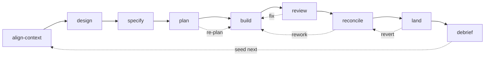

# Dev-sprint graph — the map

The consolidated whole-picture view: every node with its type, goal, and edges — the single
artefact we author from. Detail and prior art live in [`graph-design.md`](graph-design.md);
decisions in [`decisions.md`](decisions.md). This is the authoring reference, current to the
decision log — the model is **native references (D33) + 1:1 nodes (D34) + crystallization
(D35)**. Authoring has begun: the `review` lens-panel is built (see
[`build-log-review.md`](build-log-review.md)).

## Legend

**Primitive:** `skill` (loads into current context — operator-in-loop) · `agent` (isolated
context, returns a summary) · `script` (deterministic executable) · `inline` (tool/MCP call in a
body, not a node) · `ref` (a single-source shared **reference**, `graph/_refs/<id>.md`,
`kind: reference`, depended on via a `references` edge with `load: import | on-demand`, D33).
**Collab:** C = collaborative · A = autonomous · — = n/a.
**Edges:** `precedes`/`can-follow` (process, may cycle) · `invokes`/`loads`/`composes-into`/
`references` (structural, with `load: import \| on-demand`) · `overlay` (harness). Modes are
body branches of a node, not nodes (D34) — one node ⟷ one primitive.

## The arc (backbone + loops)

Sub-arcs and the shared layer attach by `invokes`/`composes-into` (see tables). The collaborative
front (align→design→specify→plan) and close (reconcile→debrief) run in the **main thread**; the
**build** and **review** spans fan out to **isolated agents**.

## Backbone stages (9)

| id | primitive | collab | goal (outcome) | composes / invokes |
|---|---|---|---|---|
| `align-context` | skill | C | shared, correct intent + constraints before design | explore; modes: lightweight/standard/deep/spec |
| `design` | skill | C | load-bearing questions resolved by outcome; design doc out | explore, lens-family (doc, strategy-first then parallel) |
| `specify` | skill | C | design → canonical spec amendment + touchpoints | pr-author, drift-detector (spec-layout only; else null) |
| `plan` | skill | C | staged, dependency-annotated plan; agent-per-workstream; teaches planning principles | explore, lens-family (plan-review, sequential); modes: compose/deepen/re-plan |
| `build` | skill | C→A | planned change implemented to spec, checkpointed (long autonomous span) | debug, explore, worktree, per-unit workers; modes: inline/serial/parallel |
| `review` | skill | C | independent verification before landing; findings triaged | lens-family (diff, parallel) via the `lens-dispatch` reference — conditional lenses incl. qa/runtime, performance, and the security dimension are dispatched through it, not separately direct-invoked; modes: interactive/autofix/report-only/headless |
| `reconcile` | skill | C | spec ?= reality; owns reconcile→build loop + gate to land | spec-diff, log-decision, harness spec-amend; modes: draft/adjudicate/enact |
| `land` | skill | C+gate | verified change to prod, confirmed healthy | ship → deploy → canary |
| `debrief` | skill | C | measure outcomes, capture learnings, amend/route, seed next | measure-outcomes, capture-learnings, log-decision |

`dev-sprint` itself is the **arc** — derived from these stages' `composes-into` + process edges,
not a file.

## Sub-arcs (invoked; also standalone)

| id | primitive | goal | invoked by | notes |
|---|---|---|---|---|
| `debug` | skill | root-cause + minimal fix (Iron Law: no fix without root cause) | build, review | invokes `investigate-probe` |
| `investigate-probe` | agent | read-only hypothesis probe (×N parallel) | debug | |
| `code-review` | skill→agents | static diff correctness/safety review | review; standalone | back-ends (codex/mistral) pluggable; modes ×4 |
| `qa` | skill | live behavioural browser testing + fix-loop | review; standalone | uses browse; `qa-only` = report-only mode |
| `security` | agent | security judgment, diff to whole-surface | review, plan, standalone/periodic | **one persona-agent, mode-surfaced** across **three homes** (lens / plan-lens / daily / comprehensive): `lens-security` (review diff) and a plan-lens (plan doc) are the *same* persona with `target:`; `daily`/`comprehensive` are standalone whole-surface audit modes. Not a separate node per home |
| `design-review` | skill | visual QA on the live app + fix-loop | review; standalone | uses browse; shares ux-principles |
| `plan-design-lens` | skill | plan-stage design completeness + mockups | design, plan | the design lens's doc home |
| `design-shotgun` | skill | generate visual variants, comparison board, collect feedback | design (UI work) | uses `$D` + browse; the *generate* half of the shotgun pattern |
| `design-implement` | skill | production UI (HTML/CSS) from an approved design | build (UI units) | design-html / CE `ce-frontend-design`; shares DESIGN.md + ux-principles |
| `optimise` | skill | generate impl variants → benchmark each → select winner | build (perf-critical); standalone | the generate-measure-select shape; composes worktree + benchmark |
| `ship` | skill | tests→coverage→version→commit→PR (ends at PR) | land; standalone | |
| `deploy` | skill | merge → deploy → wait | land | modes: staging-first/prod-direct/staging-only |
| `canary` | agent | post-deploy health on live prod | land; standalone | **crystallizing (D35)** — builds product-specific post-deploy canary assets, can't be a fixed factory script; uses browse; modes: quick/full |
| `scrape` | skill | read-only data extraction | standalone (peripheral) | uses browse |

## Lens family (shared; D27)

One **dispatch reference** (the fan-out/merge procedure, a `graph/_refs/` reference each
consuming stage depends on via a `references` edge — not a standalone node; see Non-nodes) +
one **agent node per lens** (`target`-parameterised: doc | diff). Consumed by `design` (doc),
`plan` (plan-review, sequential), `review` (diff, parallel). Product-specific lenses attach as
**harness overlays**.

**Lens-consumer invariant.** Every lens-consuming stage (review, design, plan) holds the
finding-contract references (`findings-schema` / `severity-scale` / `confidence-anchors`,
`load: import`) + the `lens-dispatch` reference (`load: on-demand`), and passes the contract into
each lens's spawn prompt — identical to the built `review`.

| id | primitive | activation | hunts |
|---|---|---|---|
| `lens-dispatch` | ref (D33) | depended on by the consuming stage (`references`) | fan-out → dedup → corroborate → confidence-gate → severity-route |
| `lens-correctness` | agent | always-on | logic, edge cases, state, swallowed errors |
| `lens-security` | agent | always-on (lower gate) | injection, authz, secrets (= `security` lens mode / shared persona) |
| `lens-tests` | agent | always-on | coverage gaps, weak assertions |
| `lens-maintainability` | agent | always-on | complexity, coupling, dead code |
| `lens-adversarial` | agent | gated (risk/size) | assumption violations, abuse cases |
| `lens-performance` | agent | conditional | DB/loops/IO/async |
| `lens-dx` | agent | conditional (dev-facing) | API/CLI/docs friction |
| `lens-runtime` | agent | conditional | error handling, retries, migrations |
| `lens-external` | agent | conditional/opt-in | cross-model (codex/mistral) second opinion |

The lens family is **code-facing**: always-on (correctness, security, tests, maintainability) +
**five** gated/conditional **code** lenses (adversarial, performance, dx, runtime, external)
after `lens-design` is removed. **Design quality is not a lens (D36)** —
it is delivered by two standalone **skills** in the sub-arc table (`design-review` for the live UI;
`plan-design-lens` for plan/design docs), which need the live main thread + a browser, the skill
side of the context axis, not the isolated agent shape the lenses take.

## Shared sub-nodes (the reuse layer)

| id | primitive | goal | consumed by |
|---|---|---|---|
| `explore` | agent | read-only context gathering → distilled digest; **substrate consumer (D38)** — reads code-map / recall / canon, proposes durable findings back to their home (not a crystallizing node) | align-context, design, plan, build |
| `spec-diff` | agent | build ↔ spec-touchpoint comparison | specify, review, reconcile |
| `log-decision` | agent | two-layer write — conclusion → `docs/decisions.md`, reasoning → gbrain (D11/D31); a small **agent** (mechanical, fully prompt-describable, no live-thread benefit per the D24 axis); **not** a crystallization node | design, reconcile, debrief |
| `measure-outcomes` | agent | compute per-node metrics vs earns-keep off the timeline (deterministic) | debrief |
| `capture-learnings` | agent | curate durable learnings (no-`Skill` constraint) | debrief |
| `pr-author` | agent | compose a PR description from settled edits | specify, reconcile, handbook-curator |
| `drift-detector` | agent | scan for amendment collisions / handbook drift | specify, handbook-curator |
| `queue-checker` | agent (haiku) | list open canon PRs / duplicate-check by file overlap (one `gh` call, read-only) | handbook-curator (raise dup-check, integrate list) |
| `consistency-checker` | agent | cross-PR consistency across the open canon queue (vocab / frontmatter / collisions) | handbook-curator (integrate) |
| `link-validator` | agent | validate cross-references + `related[]` links across pages | handbook-curator (integrate) |
| `setup-browser-cookies` | skill | import auth cookies (JIT precondition) | qa, design-review |
| `design-consultation` | skill | create DESIGN.md from scratch | design-review (loads, prerequisite) |
| `benchmark` | agent | measure perf (load, web-vitals, bundle) vs baseline; before/after + trend — **crystallizing (D35)**, builds product-specific perf assets | review (perf lens), land, optimise, debrief |
| `health` | agent | composite code-quality score + trend (types/lint/tests/dead-code) — **crystallizing (D35)**, builds product-specific quality-check assets | review, debrief |

`explore` modes (body branches of the one `explore` node, not separate nodes — D34): `repo` / `learnings` / `framework-docs` / `web` / `best-practices`.

## Curator cell — knowledge-canon maintenance (D40)

The canon-maintenance loop, modelled as a cell and **vendored** (a harness points it at its own
handbook + repo). The factory self-applies the same pattern via `tooling/sg-handbook-curator`
(dogfooding); `bc-handbook-curator` is the product instance it is reverse-engineered from.

| id | primitive | goal | fleet / refs |
|---|---|---|---|
| `handbook-curator` | skill | maintain the curated-canon home; modes (body branches, D34): `sweep` / `raise` / `integrate` / `refresh-index` | invokes `drift-detector`, `pr-author`, `queue-checker`, `consistency-checker`, `link-validator`; references `what-belongs` / `pr-description-shape` / `bundling-rules` / `integrator-checklist`; bundles the `refresh-index` script (co-located operational asset) |

**The arc (cyclic — the canon analogue of `reconcile`(open) → `land`(gate)):**

- **`raise`** — per-change, **session-end, forcing-rule triggered** (a `triggers` hook). Checks
  the queue (`queue-checker` dup-check → refuse/redirect duplicates), applies the `what-belongs`
  gate + `bundling-rules`, authors edits, `pr-author` composes the body, opens a **labelled PR**.
  The PR description *is* the proposal. *The queue IS the set of open labelled PRs* — no separate
  store.
- **`integrate`** — operator-cadence, **separate session**. `queue-checker` lists the queue;
  `consistency-checker` + `link-validator` run cross-PR checks; decisions surface **synchronously
  in the PR description** (never `AskUserQuestion` mid-mode); walk **batch merges**; call
  `refresh-index` after. Cyclic: merged canon → future work reads it → drift → `raise` again.

**D38 write-path.** This cell is *how a proposed durable finding reaches canon*: a node (e.g.
`explore`) proposes → `raise` PR → queue → `integrate` → handbook/decisions. The curator owns the
**curated-canon** home; code-map and recall homes have their own writers.

**Two loops, one cell.** Factory-loop `raise` targets `stack-graph`; harness-loop `raise` targets
the product repo — same node, repo/label/handbook-root differ by overlay (D40, [`08-devops`]).

## Cross-cutting patterns

Three shapes recur across the graph — author them once and reuse, rather than as one-offs:

- **Generate → evaluate → select (shotgun / tournament).** Fan out N candidates, evaluate in
  parallel, pick/synthesise the winner. Instances: `design-shotgun` (generator: visual variants;
  judge: operator + visual lens), `optimise` (generator: impl variants; judge: measured `benchmark`),
  and `review`'s lens-panel (generator: the diff; judge: the lens family). Shared machinery: parallel
  fan-out + `worktree-isolation` + a selection/merge step.
- **Measure vs baseline (evidence sources).** Run a target, capture hard numbers, diff against a
  stored baseline, emit a trend point — *measurement, not judgment*. Instances: `benchmark` (perf),
  `canary` (post-deploy health), `health` (code quality). All are browse/tool-driven, feed the
  relevant lens + `debrief`'s trends, and are deterministic in shape.
- **Crystallization (compounding assets) (D35).** A product-dependent node is an **agent** that
  crystallizes generative reasoning into reusable, co-located, **harness-local assets** (scripts /
  configs / checklists) behind a **stable `references` edge to an asset manifest** — so the node
  **body never changes**; later runs load and reuse the assets deterministically and reason
  generatively only about what is new or has drifted, so the **generative fraction declines per
  run**; new/changed assets are gated at `reconcile`. Instances: `benchmark` / `health` / `canary`
  (perf / quality / post-deploy assets), `qa` (test flows), `design-review` / `security`
  (DESIGN.md / threat model). **`explore` is *not* here (D38)** — its "asset" was product
  *knowledge*, which lives in the substrate homes (code-map / recall / canon), so explore
  *consumes* the substrate rather than crystallizing a co-located manifest.

The **visual-design thread** spans the arc: `design-consultation` → `design-shotgun` (design) →
`design-implement` (build) → `design-review` (review), all sharing DESIGN.md (harness overlay),
the `ux-principles` ref, and the browse + `$D` tools.

## Non-nodes — tools and references

Shared content is a **reference** (`graph/_refs/<id>.md`, `kind: reference`), depended on via
a `references` edge with a `load` dial — `import` (native `@-import`, guaranteed-present) for
short invariants, `on-demand` (a pointer read at the step of need) for larger or conditional
material. The build single-sources each into its consumers; there is no injected-block
primitive (D33).

| id | kind | note |
|---|---|---|
| `browse` | inline tool / ext binary | headless browser behind a `browser.exec` pointer; tool-agnostic (gstack `$B` / Chrome MCP / `agent-browser`) |
| `worktree-isolation` | inline / script | isolated checkout for a unit of work; native `isolation:'worktree'` + `.worktreeinclude`, script fallback. Consumed inline by build, review, reconcile — an execution surface, not a node |
| `gbrain` | inline MCP | recall substrate (the two-layer decisions store's recall half) |
| `.worktreeinclude` | ref | committed list of files to copy into worktrees (D30) |
| `DESIGN.md` | ref (harness) | product design system; harness overlay |
| `decisions-store` | ref | `docs/decisions.md` — curated conclusions (D11) |
| `ux-principles` | ref (on-demand) | factored shared UX doctrine (design-review + plan-design-lens) |
| `IU-schema` | ref (import) | Implementation-Unit field contract (plan ↔ build) |
| `findings-schema` / `severity-scale` / `confidence-anchors` | ref (import) | the lens/review finding contract |
| `instrumentation-preamble` | ref (import) | event emitter single-sourced into every node (D20) |
| `lens-dispatch` / `merge-triage` | ref (on-demand) | the shared fan-out + aggregation machinery |
| _others_ | ref (provisional) | gbrain-load, outcome-gate, decision-classifier, cross-model-challenge, iron-law, causal-chain-gate, escalation-3-strike, structured-report, scope-lock, checkpoint-commit, test-discipline, base-ref, qa-methodology, git-branch-setup, spec-touchpoints-table, reviewer-attachment, pr-description-shape, design-doc-template, scope-detection. **Note:** these ids are **unclassified** — several read like **rules** (`iron-law`, `test-discipline`) rather than references. Each gets its 07 routing (reference vs rule vs inline) when authored; do **not** pre-commit them all to `ref`. |

## Edges at a glance

- **Process (backbone, may cycle):** the 8 `precedes` edges align-context→…→debrief; loops
  `review→build`, `reconcile→build`, `plan→build` (re-plan), `land→reconcile` (revert),
  `debrief→align-context` (seed next sprint).
- **invokes:** stage → sub-arc (build→debug, land→{ship,deploy,canary}); `review` runs the lens
  family via the `lens-dispatch` **reference** (the dispatch logic `invokes` each lens — including
  the conditional qa/runtime, performance, and security-dimension lenses — one-way), it does not
  direct-invoke `qa`/`security`/`design-review` as sub-arcs; stage → shared sub-node (→explore,
  →spec-diff, etc.); debug→investigate-probe; qa/design-review→setup-browser-cookies (JIT).
- **composes-into:** every stage → `dev-sprint` (with `stage:`). Lenses do **not** compose-into
  the dispatch reference — the dispatch logic `invokes` each lens (one-way), and the lenses
  `composes-into` the arc they serve (via their consuming stage). No structural cycle (D4).
- **references (`load: import | on-demand`):** nodes → shared refs (browser.exec, DESIGN.md,
  decisions-store, ux-principles, IU-schema, findings-schema, instrumentation-preamble,
  lens-dispatch, .worktreeinclude). The build single-sources each into its consumers (D33).
- **overlay (harness):** product-specific lenses, DESIGN.md, deploy-config, spec-layout-config,
  threat-model + secret-store → attach additively; vendored graph never mutated.

## Counts & what's left to decide

Recounted from this map's own tables: **9 backbone stages + 14 sub-arcs + 9 lens agents** (the
ten lens-family rows minus `lens-dispatch`, which is a **reference**, not a node, and minus
`lens-design`, removed per D36) **+ 11 shared sub-nodes = 43 authored nodes** — plus the non-node
tools/references (`lens-dispatch`, `worktree-isolation`, `browse`, the shared `graph/_refs/`
references). (The earlier "≈33 / ~35" figures were loose under-counts; 43 is the table count.
Note `lens-security` is the same shared persona as the `security` sub-arc node, and the two design
**skills** appear only in the sub-arc table — so 43 counts table rows, not distinct personas.)

Structural questions to settle at the handbook resync / first authoring (rolled up from the wave
open-Qs):

1. **Lens family:** collapse doc/diff into one parameterised lens per dimension (recommended).
   *Resolved:* `lens-dispatch` is a **reference** (`graph/_refs/`) the consuming stage depends on
   via a `references` edge, not a node; the dispatch logic `invokes` the lens agents (one-way, no
   cycle).
2. **Modes-as-nodes rendering:** *Resolved (D34)* — one node ⟷ one primitive; a node's modes
   are branches in its one body, never separate nodes. A mode becomes its own primitive only
   if it earns its own measurable goal (then it is 1:1 like any node).
3. **Multi-home nodes** (security, design): *Resolved for security* — one persona-agent across
   **three homes** (lens / plan-lens / daily / comprehensive), mode-surfaced via `target:` and
   scope/gate (not sibling nodes). Design quality is **two skills** (`design-review` live UI /
   `plan-design-lens` plan-doc), not a lens — D36; see the Lens-family invariant.
4. **Native primitives to ride:** `isolation:'worktree'` + `.worktreeinclude`; confirm stability vs
   the script fallback.
5. **Harness overlay boundary:** product lenses, DESIGN.md, deploy/spec-layout/threat-model config all
   land in the harness — confirm the factory stays general.
6. **`browse`/`worktree` as non-nodes:** *Resolved* — both are inline execution surfaces, listed
   under Non-nodes, never authored as graph nodes.
